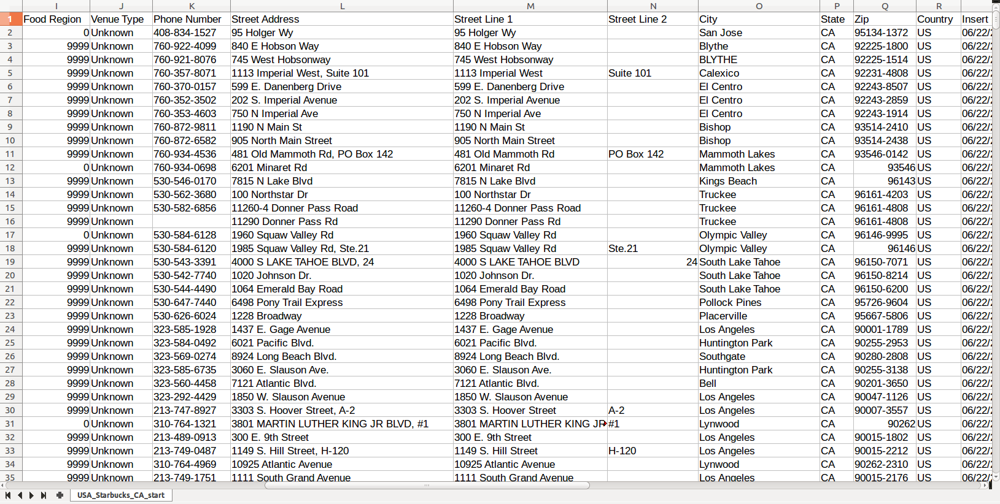
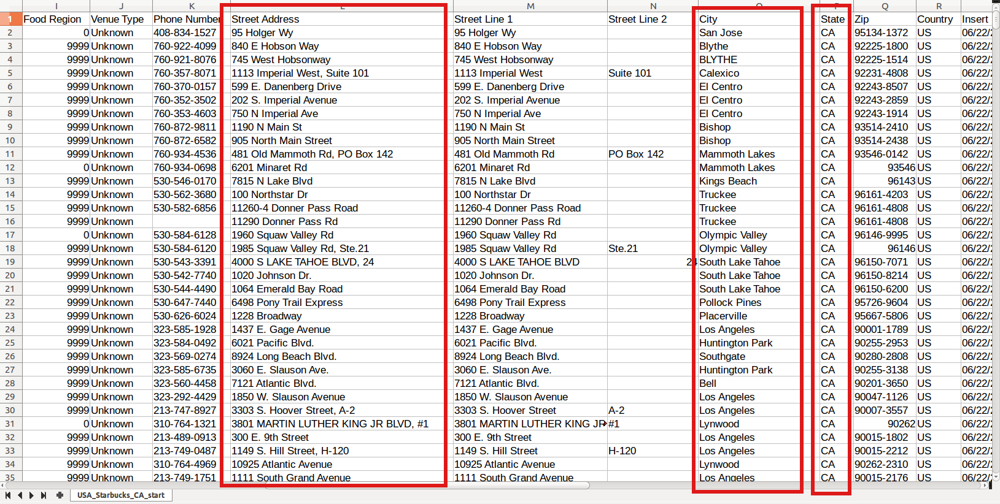
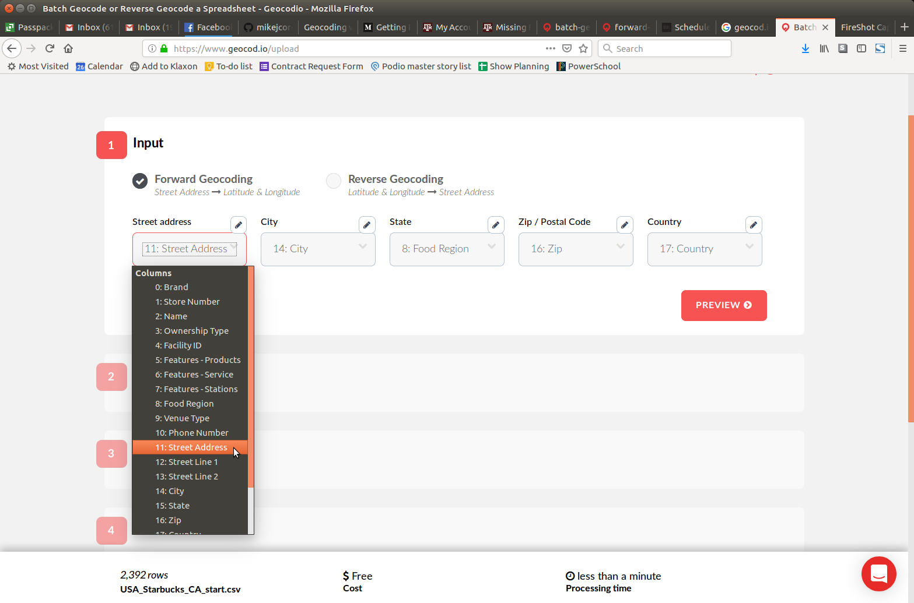
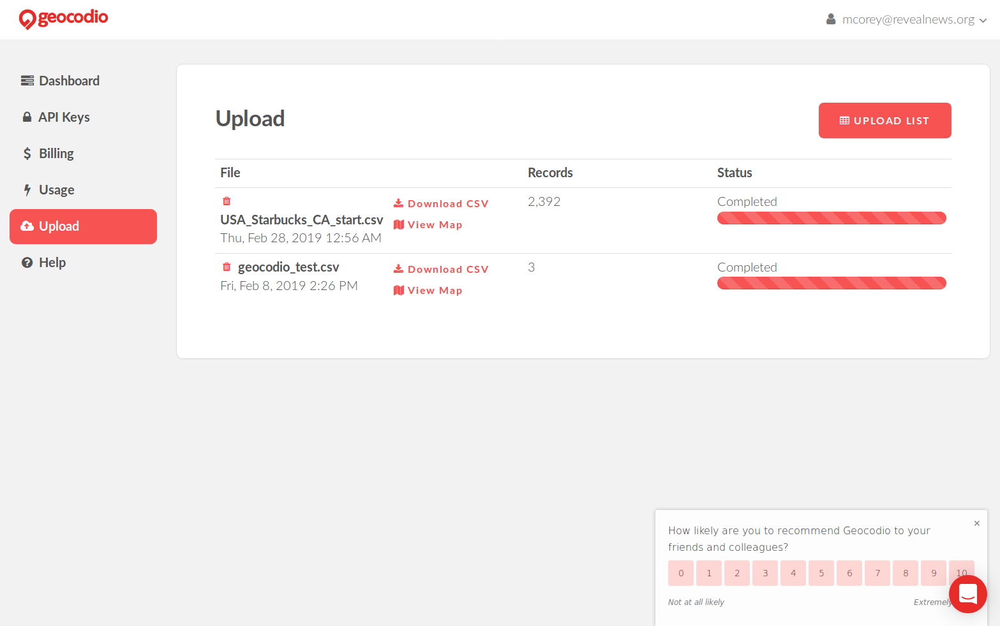

_Cribbing fairly heavily from a previous version by Denise Malan and Liz Lucas_

## What is geocoding?

Often we get a dataset with an address for each record, and often we would like to place that address on a map. In order to do that, you need to translate your addresses to latitude/longitude coordinates. The process a computer uses to calculate the coordinates for an address so it can place it on a map is known as geocoding.

### Which one is latitude again?

Latitude = Y axis (north and south)  
Longitude = X axis (east and west) -- Think long and not tall

### OK are we geocoding yet?

No, we are going to talk about boring but important things first.

## How many things do you need to geocode?

1 thing: Google it.  
10 things: Google them.  
100 things: You have so many choices!  
10,000 things: OoooOooooOOOooooo. Meet Geocod.io.*  
Outside North America: Your mileage may vary  

_*Or do it with the Google Geocoding API, if you're going to put it on a Google Map._

## Do you have/need address-level data or city-level data?

Our data: 2,392 California Starbucks locations

## Terms of Service

Always read the terms of service, and don't assume you won't get caught

#### Common restrictions
- Can you cache your lat-lng points?  

- Where are you allowed to use those lat-lng points (often, only in the vendor's own products)

- Cost structure (2,500 free is common, but sometimes that's forever and sometimes that's per day)

## Prepping your data

Ideally, you'll have address, city and state in separate columns.

And we want the address column with the whole address, not split up (which is better for a mail merge). But if your data only has these separately, it's straightforward to merge them in Excel.

# Geocod.io

## Creating an account

## Spreadsheet vs. API

Today we're going to upload as spreadsheet of data, but you can also use Geocod.io's API with bulk data or a single lookup (for example for looking up an address live for a user):

## Uploading data

Click on "Drop your spreadsheet here":

Tell Geocod.io which columns to use:

... Then click preview to make sure your addresses landed in sensible places:

... Then click "Yes, looks good."

## Upgrades!

Depending on what you're doing with your data, you might want to append demographic stats for a given address as you geocode. You can do this on your own without Geocod.io, and there is a small cost, but this can save you a lot of time and hassle!

... But for today, we don't need anything else, just the points. Click "continue."

... And click "Start" to roll the ~~presses~~ geocoder.

## Now we wait

## The hard/important part: Check the results

View map for a visual bullshit check...

But we need to do better than that and understand what the geocoder did with each address.

# Example 2: City-level data with Geocod.io

## Rules of the road

## Find unique cities

## Merge back into your data

# When geocoding goes wrong
