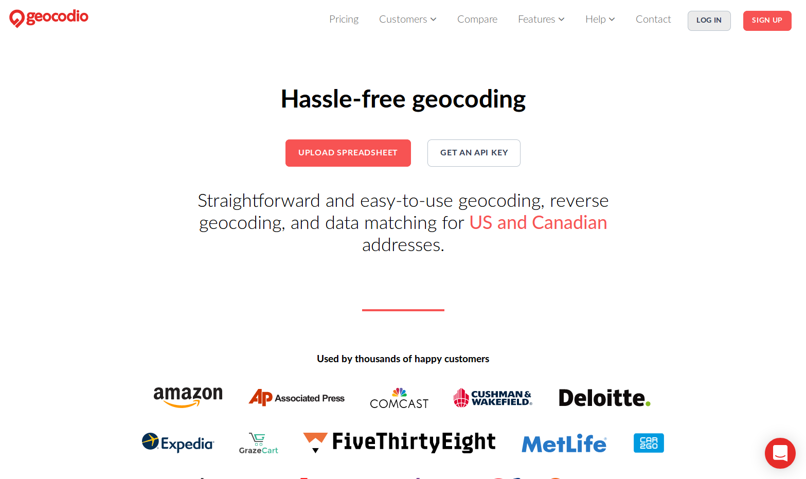
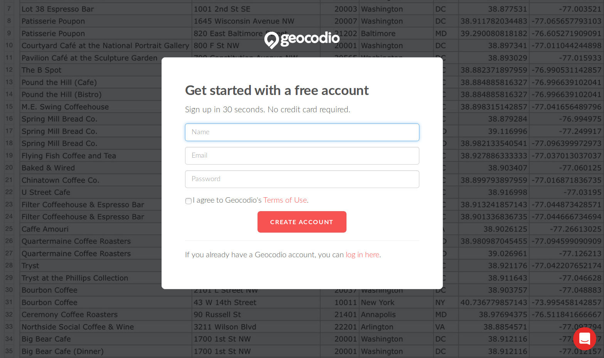
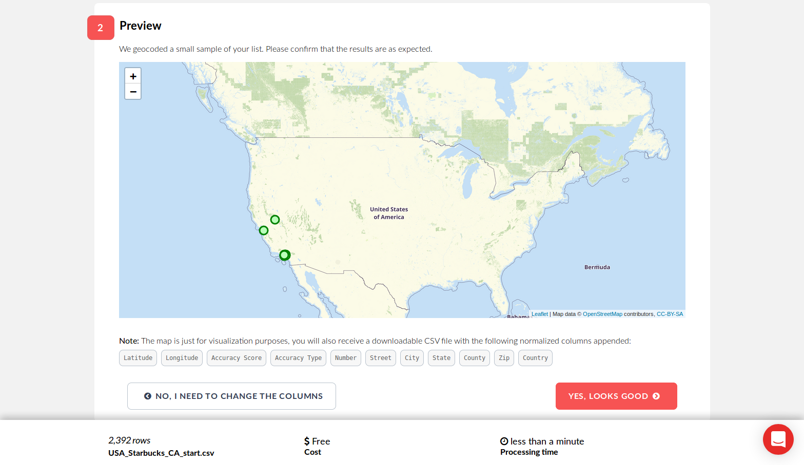
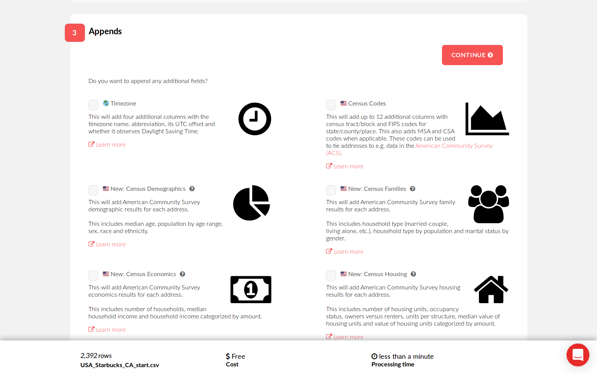
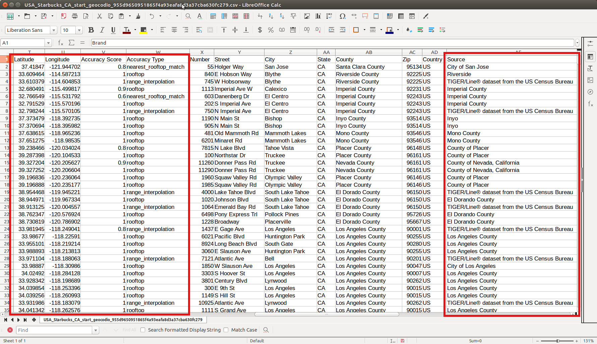
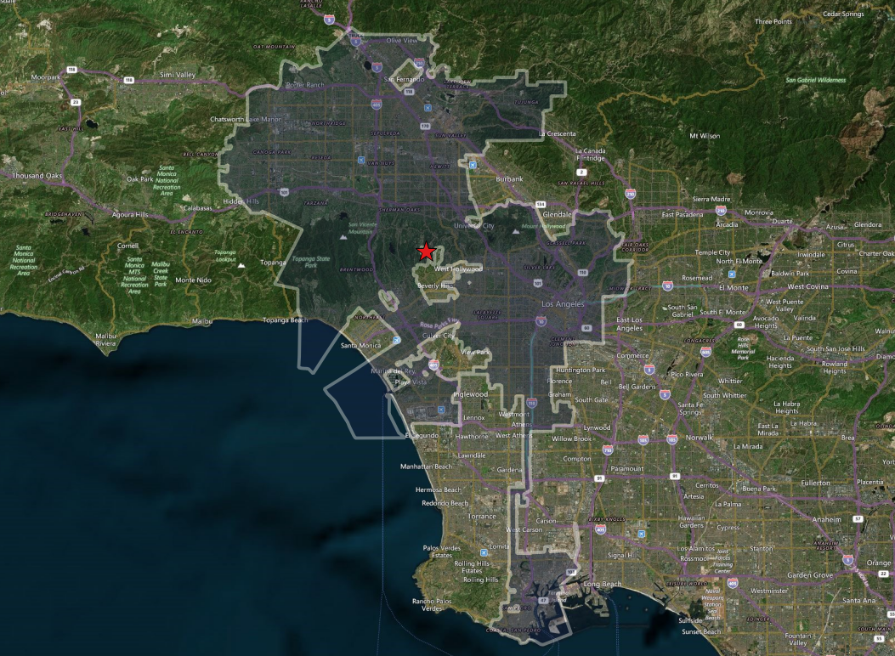

_Cribbing from a previous version by Denise Malan and Liz Lucas_

## What is geocoding?

Often we get a dataset with an address for each record, and often we would like to place that address on a map. In order to do that, you need to translate your addresses to latitude/longitude coordinates. The process a computer uses to calculate the coordinates for an address so it can place it on a map is known as geocoding.

### Which one is latitude again?

Latitude = Y axis (north and south)  
Longitude = X axis (east and west) -- Think long and not tall

### OK are we geocoding yet?

No, we are going to talk about boring but important things first.

## How many things do you need to geocode?

1 thing: Google it.  
10 things: Google them.  
100 things: You have so many choices!  
10,000 things: OoooOooooOOOooooo. Meet Geocod.io.*  
Outside North America: Your mileage may vary  

_*Or do it with the Google Geocoding API, if you're going to put it on a Google Map._

## Do you have/need address-level data or city-level data?

Our data: 2,392 California Starbucks locations

## Terms of Service

Always read the terms of service, and don't assume you won't get caught

#### Common restrictions
- Can you cache your lat-lng points?  

- Where are you allowed to use those lat-lng points (often, only in the vendor's own products)

- Cost structure (2,500 free is common, but sometimes that's forever and sometimes that's per day)

## Prepping your data

Ideally, you'll have address, city, state and zip in separate columns.

Many times you will get data where the addresses have typos, misspellings, or are missing the directional prefix (such as N. for North) or the suffix (such as St. for Street). In these cases it is
best to try and do some cleaning before you geocode. If you put garbage in, you get garbage out.

It’s also often important to have a zip code; many geocoders will not work or give you bad results without them. If you didn’t get zip codes, consider whether it’s feasible to put them in.

And we want the address column with the whole address, not split up (which is better for a mail merge). But if your data only has these separately, it's straightforward to merge them in Excel.

# Geocod.io

## Creating an account

## Spreadsheet vs. API

Today we're going to upload as spreadsheet of data, but you can also use Geocod.io's API with bulk data or a single lookup (for example for looking up an address live for a user):

## Uploading data

Click on "Drop your spreadsheet here":

Tell Geocod.io which columns to use:

... Then click preview to make sure your addresses landed in sensible places:

... Then click "Yes, looks good."

## Upgrades!

Depending on what you're doing with your data, you might want to append demographic stats for a given address as you geocode. You can do this on your own without Geocod.io, and there is a small cost, but this can save you a lot of time and hassle!

... But for today, we don't need anything else, just the points. Click "continue."

... And click "Start" to roll the ~~presses~~ geocoder.

## Now we wait

## The hard/important part: Check the results

View map for a visual bullshit check...

But we need to do better than that and understand what the geocoder did with each address.

Yes, we have our purported latitude and longitudes. But how accurate are those results? A good geocoder tells you more. We get an numerical score, the method used to place this row, and even the original source of the data used. This allows us to make an educated decision about whether each point (or type of result) is good enough to be used. Note: The numerical score and the method are not the same thing.

#### Common match methods
- rooftop
- nearest_rooftop_match
- range_interpolation

# Example 2: City-level data

Sometimes, often with a national map, it's sufficient to place points in the center of a city. Other times, you might only have city-level precision.

## Rules of the road
- Some cities are very big, so if you're zoomed in close this could be misleading

- Generally the point will map to the CENTROID, or geographic center, of a city, which may or may not be anywhere near the center of activity.

### Los Angeles centroid: in the hills

### San Francisco centroid: in the water

## Find unique cities

- Copy your city and state columns to a new spreadsheet

- Make a third column in the new spreadsheet, with the two cells merged (separated by comma)

- Find the distinct rows

- Geocode this spreadsheet

## Merge back into your data

VLOOKUP(WHAT_TO_MATCH_ON_LEFT, WHAT_DATA_TO_MATCH_IT_TO_RIGHT, WHAT_CELL_IN_RIGHT_DATA_TO_PUT_HERE)

# When geocoding goes wrong

### Null Island
One common error is placing the point at (0,0).

A good check is to sort your results by latitude then longitude to check for duplicates all placed at the same point or at (0,0). If you find some, those addresses might need more work for the geocoding service to place them correctly.

Doing these integrity checks are very important, so that you don’t miss something like this:

http://www.vox.com/2014/4/21/5636040/whats-the-matter-with-kansas-and-porn

VOX did an analysis of internet porn traffic by getting IP address data from Pornhub.com, one of the largest internet porn sites, and geocoding the IP addresses. As their title suggests, they found that Kansas was the home to a crazy amount of porn traffic, and said so. In fact, it wasn’t just Kansas, it was one city in particular: Wichita.

After publishing their results, it came out that Wichita was so off the charts because it is in the center of the country. When the geocoder couldn’t place the IP addresses exactly, it used the whole country as its matching geography type and plopped them right in the center of that geography, right onto Wichita. Vox changed the headline and published a correction at the top of the story.

_For great commentary on all the things that were not great about this analysis, [go here](https://source.opennews.org/articles/distrust-your-data/)._

## Final words!

When you get data that contains addresses and you’re tempted to jump straight to the geocoder, ask yourself a few questions first:
!
1. Why do I want to see these addresses on a map? Will it help me understand the scope of the data? Are geographic clusters potentially important? Could these locations have a spatial relationship (close together, far apart, clustered, segregated, etc) that would be meaningful?

2. What does the data look like? Are the addresses neat, containing all the necessary pieces: prefix (such as N. for North), suffix (such as St. for Street), standardized names (without a lot of misspellings or typos), a zip code? If its missing one or more of these things, how hard will it be to clean the data up?

3. How important is the accuracy to the zip code? If you just want to look at your data points zoomed out at the county or state level, you can accommodate more relaxed geocoding; if a point is plotted a block or two away from where it should be, looking at the state level that is not necessarily a big deal. But if you want to really zoom in and see points plotted at the street level, accuracy is more important.

Remember that geocoding is not an exact science and no geocoders will be perfect; diligently check results and look at all the information available to you to assess how well your addresses were geocoded.
